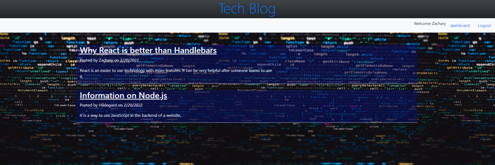

# Technology Blog Application 

## Description
This is an application that allows users to make posts about technologies. Users can create accounts, make blog posts, and comment on blog posts.

## Table of Contents
* [Installation](#installation)
* [Usage](#usage)
* [License](#license)
* [Contribution](#contribution)
* [Tests](#tests)
* [Questions](#questions)

## Installation 
This application can be installed by cloning this repository. After that you will run `npm i` then `npm start` to start the application.

## Usage 
This application is used to make techblog posts. First a user will need to create an account with their email, username, and password. A user can then make blog posts in their dashboard, edit blog posts on the link to the blog posts, and comment on the link to any blog posts.

## License 
Copyright zachary-berdell-elliott

Permission is hereby granted, free of charge, to any person obtaining a copy of this software and associated documentation files (the “Software”), to deal in the Software without restriction, including without limitation the rights to use, copy, modify, merge, publish, distribute, sublicense, and/or sell copies of the Software, and to permit persons to whom the Software is furnished to do so, subject to the following conditions:

  The above copyright notice and this permission notice shall be included in all copies or substantial portions of the Software.
    
  THE SOFTWARE IS PROVIDED “AS IS”, WITHOUT WARRANTY OF ANY KIND, EXPRESS OR IMPLIED, INCLUDING BUT NOT LIMITED TO THE WARRANTIES OF MERCHANTABILITY, FITNESS FOR A PARTICULAR PURPOSE AND NONINFRINGEMENT. IN NO EVENT SHALL THE AUTHORS OR COPYRIGHT HOLDERS BE LIABLE FOR ANY CLAIM, DAMAGES OR OTHER LIABILITY, WHETHER IN AN ACTION OF CONTRACT, TORT OR OTHERWISE, ARISING FROM, OUT OF OR IN CONNECTION WITH THE SOFTWARE OR THE USE OR OTHER DEALINGS IN THE SOFTWARE.

## Contribution 
This application can be contributed to by testing it for any bugs then reporting them to me.

## Tests 
This application can either be tested at the live link or after installing it.

## Questions 
FAQ: 

There are currently no frequently asked questions

If you have any additional questions, please contact me at zacharyberdell@gmail.com to receive an answer to your question. If you would like to view other projects by me then [visit my profile here.](https://github.com/zachary-berdell-elliott)
